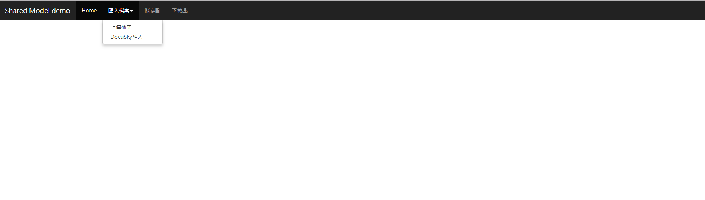
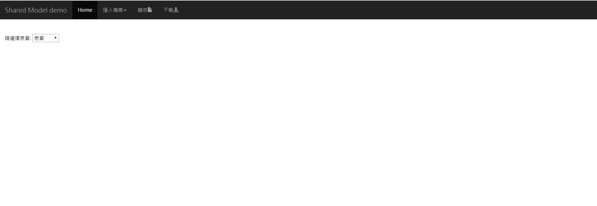
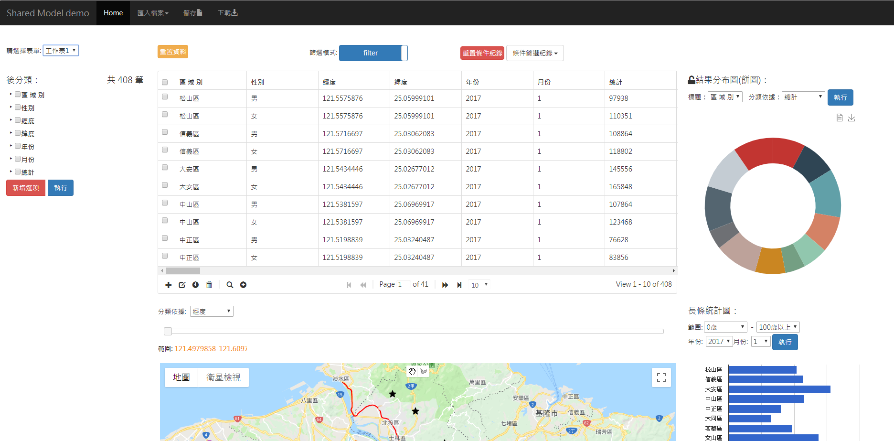

# demo系統

demo系統將來會放置在DocuSky上: [http://docusky.digital.ntu.edu.tw/docusky/ds-01.home.html](http://docusky.digital.ntu.edu.tw/docusky/ds-01.home.html)

測試資料與程式碼也會放置於該平台上，再請使用者於該平台上操作。

使用者能使用測資或是自己的excel檔案加上前面提到的標籤後，即可匯入使用。

步驟:

1. 進入網頁後，先選擇匯入方式，可從本地端上傳或是從DocuSky匯入已加過標籤的資料。

2. 選擇要匯入的表單\(sheet\)，從DocuSky的話則無法選擇。

3. 於是資料進入系統後就能用各種視覺化工具呈現，使用者就能開始在上面進行操作。

4. 結束操作後也能儲存回DocuSky，或是下載回local端。

